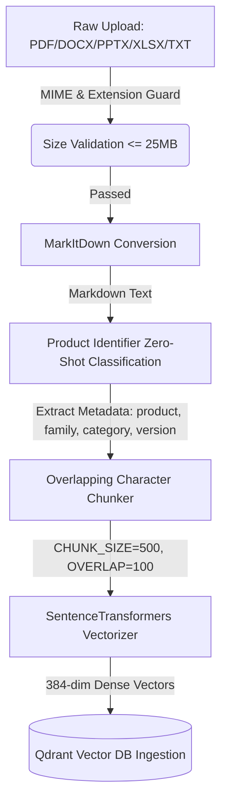
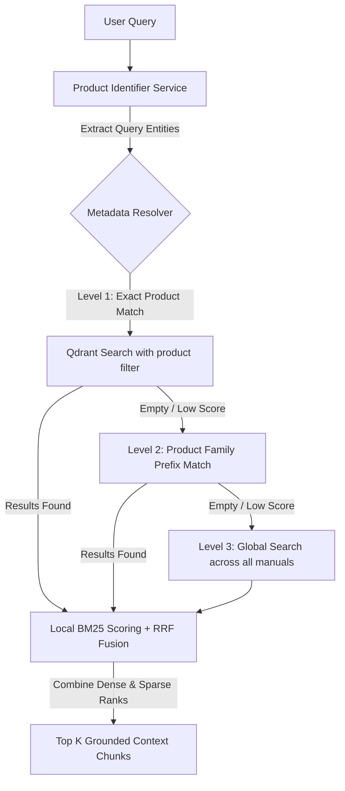
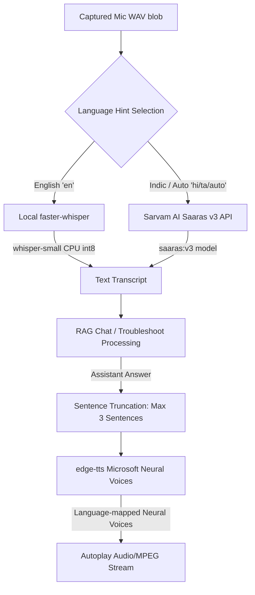
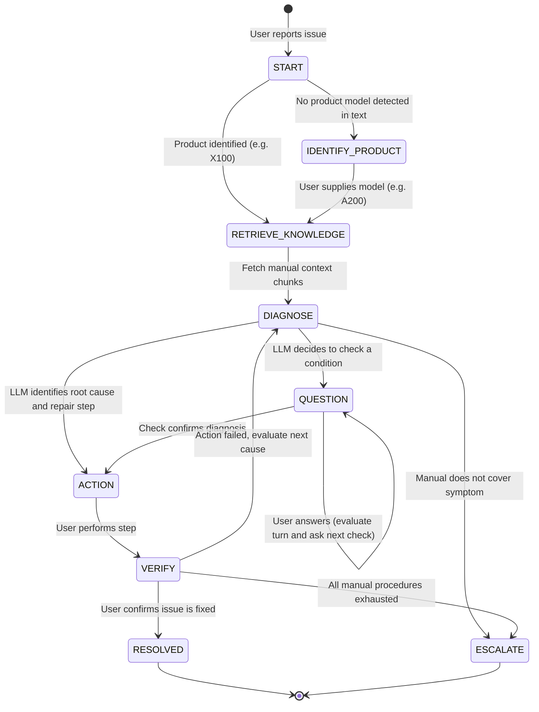

# Architecture Specification — Multimodal RAG Assistant & Agentic Engine

This document provides a comprehensive technical breakdown of the systems, pipelines, orchestration state machines, and security layers implemented in the Multimodal RAG Assistant.

---

## 1. Document Ingestion Pipeline

During ingestion, documents are parsed, categorized using zero-shot classification, chunked, vectorized, and stored with rich metadata fields.



### Payloads Stored in Qdrant
```json
{
  "chunk_id": "x100_manual.pdf::chunk_12",
  "content": "To resolve Error E105, power off the device, remove the rear cover...",
  "source_file": "x100_manual.pdf",
  "product": "X100",
  "model": "X100",
  "category": "Printer",
  "version": "v1.2",
  "product_family": "X-Series",
  "section": "Troubleshooting",
  "page": 24
}
```

---

## 2. Context-Aware Hierarchical Hybrid Search

Retrieval queries pass through entity extraction and run on a 3-level prioritized search hierarchy to ensure the most specific documentation is retrieved first, combining dense similarity and sparse BM25 scores using Reciprocal Rank Fusion (RRF).



### Fusion Algorithm (RRF)
$$\text{RRF Score}(d) = \sum_{m \in M} \frac{1}{k + r_m(d)}$$
Where $M = \{\text{dense}, \text{sparse}\}$, $k = 60$, and $r_m(d)$ is the rank of document $d$ in result list $m$.

---

## 3. Voice Communication Layer (STT & TTS)

A hybrid audio layer transcribes incoming captured microphone signals and synthesizes outgoing assistant answers to stream playable speech.



---

## 4. Agentic Troubleshooting Orchestration State Machine

For troubleshooting issues, the assistant runs a state machine to track context across turns, ask check questions, suggest corrective repairs, and verify resolutions.



### Troubleshooting Session Registry Payload
```python
{
    "session_id": "test_session_abc",
    "product": "X100",
    "issue": "E105",
    "step": 2,
    "status": "QUESTION",  # Active State
    "last_question": "Is the cooling fan spinning at all?",
    "last_action": "Power off the device, inspect rear connector...",
    "history": [
        {"question": "Is the power LED blinking?", "answer": "Yes"},
        {"question": "Is the cooling fan spinning at all?", "answer": "No"}
    ],
    "context": [...]  # Active RAG Context Chunks
}
```

---

## 5. Security & Isolation Layers

Each incoming API call passes through a series of security filters before hitting the core RAG or LLM processing code.

```mermaid
graph LR
    A[Client Request] --> B[slowapi Middleware: Rate Limiter]
    B -->|Check IP Limits| C[Pydantic Schema constraints: Field Lengths]
    C -->|Check Text Size| D[Prompt Guard: Injection detection]
    D -->|Check override patterns| E[Context-Isolated Prompt Builder]
    E -->|Execute RAG| F[LLM Generation]

---

## 6. Unified Agentic Ingestion + Retrieval Flow (LangGraph)

For ad-hoc queries combining ingestion and retrieval, the system routes tasks through a bounded **LangGraph `StateGraph`** with conditional routing decisions. This enables LLM-driven path routing (e.g. asking for clarification on product name ambiguity) while maintaining deterministic processing node boundaries.

```mermaid
graph TD
    Start([Start Route]) --> Router{Ingest Router}
    
    Router -->|URL input| URL[url_ingest: Scraping BS4]
    Router -->|File input| File[file_ingest: MarkItDown Parse]
    Router -->|No Ingestion input| ID[identify_product: Product Matching]
    
    URL --> VC[version_check: Hash matching SQLite]
    File --> VC
    
    VC -->|Hash Changed| Embed[embed_and_store: Chunk & Index Qdrant]
    VC -->|Hash Unchanged| ID
    Embed --> ID
    
    ID -->|Ambiguous Product| Format[format_response: Clarification Ask]
    ID -->|Resolved Product| Classify[classify_mode: QA vs. Troubleshoot]
    
    Classify --> Retrieve[retrieve: RRF Hybrid Retrieval]
    Retrieve --> Gen[generate: QA / Structured JSON Steps]
    Gen --> Format
    
    Format --> End([END])
```

### Agent State Schema
```python
class AgentState(TypedDict):
    query: str
    source_input: Optional[str]        # URL or filename/path
    source_content: Optional[bytes]    # raw uploaded file content
    product_id: Optional[str]
    clarification_needed: bool
    retrieved_chunks: list[dict]
    sources: list[dict]
    mode: Literal["qa", "troubleshoot"]
    answer: str
    steps: list[str]
    content_changed: bool
    version_info: Optional[str]
    clarification_options: list[str]
```

```
